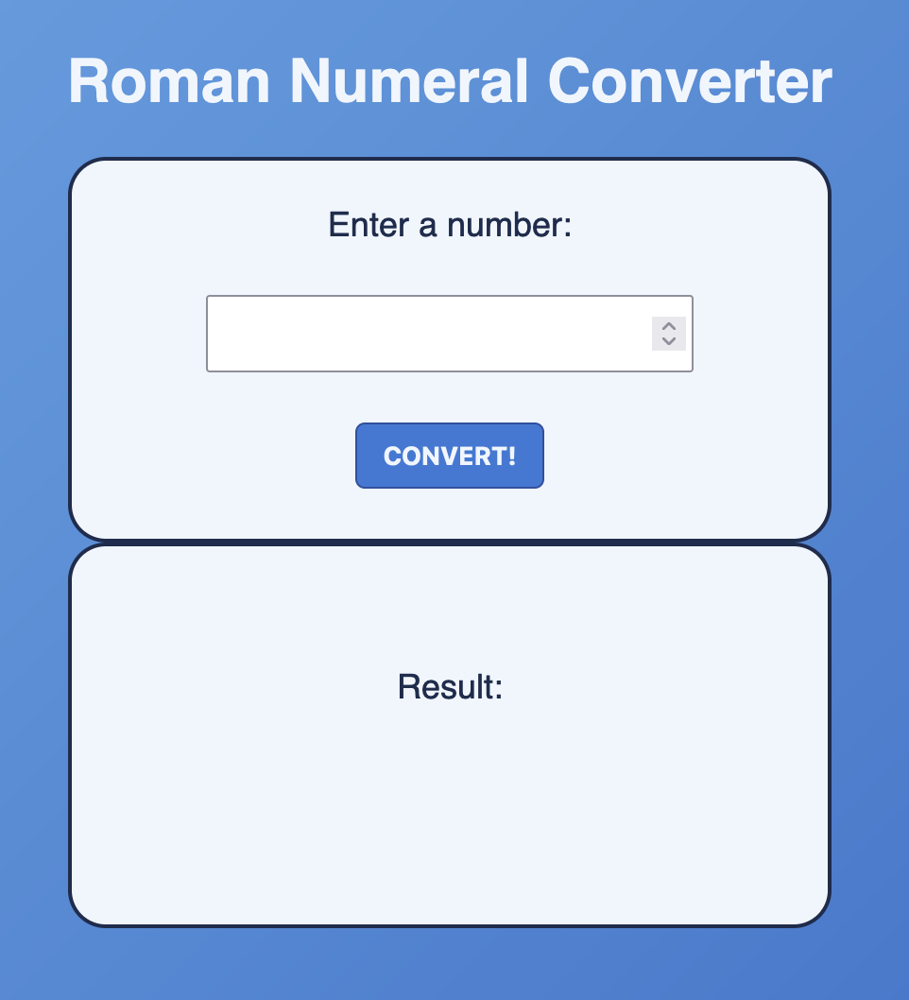

### Roman Numeral Converter

This project converts a number input into roman numerals.

> _Roman numerals_ are based on seven symbols and can be written using various combinations to represent Arabic numerals.

#### Using the Roman Numeral Converter

Enter the number you would like to convert into the input field, then press the _CONVERT!_ button.

#### Test Cases

The input `9` should return `IX`.
The input `16` should return `XVI`.
The input `4318` should return `"Please enter a number less than or equal to 3999"`.
The input `649` should return `DCXLIX`.

#### freeCodeCamp Disclaimer

This project was completed as part of [freeCodeCamp.org](https://www.freecodecamp.org)'s _JavaScript Algorithms and Data Structures_ course. This was a Certification Project, meaning [freeCodeCamp](https://www.freecodecamp.org) provided specifications and limited guidance and I was expected to code to meet certain test cases. The code presented here is my own.
